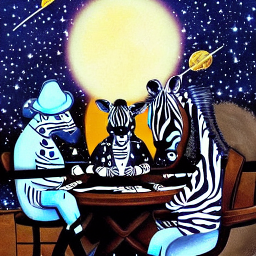

# 🦓 ArtiDix 🃏 DixiMint

NFT game with AI generated images from text and players incentives.

## What

Users can write down in text what image to generate and receive their unique NFTs. The minting price increases by a small amount with every generated image. Users can also opt-in to the game that is to be introduced later, where others have to guess the initial phrase that the image was generated from.

## How

Using scaffold-eth to work with Polygon chain, IPFS to store images, and DALL-E for image generation.

.png>)

## Plans to develop:

### Front

- ☐ Welcoming page & game intro
- ☐ Transact open NFT Mint request
- ☐ Share challenge
- ☐ Game invitations - see and try guess
- ☐ Winnings collecting?

### Smart contracts

- ☐ Updateable, Ownable game logic contract
- ☐ Open mint request
  - ☐ Store initial phrase hash
- ☐ Close mint request
- ☐ Increasing price
- ☐ Switch NFT to Game more by owner
- ☐ Win/Lose funds distribution
- ☐ Win/Lose NFT
- ☐ Phrase validity control mechanism (DAO?)

### API

- ☐ Validate open generation request hash on chain
- ☐ Enqueue generation requests

### AI microservice

- ☐ Pick requests from incoming queue
- ☐ Generate image
- ☐ Image upload to IPFS
- ☐ Put IPFS hash to processed queue
- ☐ Close NFT Mint request
- ☐ Post-minting user notifications?

### Infrastructure

- ☐ Setup ML development environment
- ☐ Setup Front Static Site
- ☐ Setup node api with mongodb atlas or mariadb
- ☐ Setup queue
- ☐ IPFS provider

## Open questions !?

- ✅ AI Hardware (where to get GPU)
- ❔ Price strategy
  - ☑️ Initial bulletproof model
- ❔ User notifications after minting completed
- ❔ Phrase validity (anti-cheat) control (Centralized manual->ai vs. DAO vs. Hybrid)

